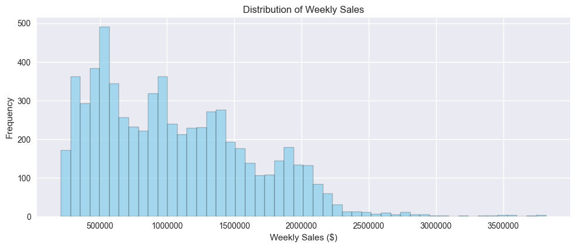

# Walmart-Sales-Prediction-Analysist

## 📦 Overview
This project implements machine learning models to predict weekly sales across 45 Walmart stores using historical sales data, economic indicators, and holiday information. The dataset spans from February 2010 to October 2012, with holiday weeks weighted 5x higher in evaluation metrics.

---

## 🎯 Key Results

### Model Performance Summary

| Model             | Test R² | Test RMSE | Test MAE | Weighted Test RMSE | CV R² Mean |
|------------------|--------:|----------:|---------:|--------------------:|-----------:|
| **XGBoost**       | **0.9889** | **$58,685** | **$38,050** | **$68,826** | **0.9886** |
| Random Forest     | 0.9749  | $88,371   | $53,203  | $119,334            | 0.9729     |
| Decision Tree     | 0.9693  | $97,625   | $61,570  | $125,018            | 0.9626     |
| Ridge Regression  | 0.9560  | $116,993  | $64,569  | $154,809            | 0.9566     |
| Lasso Regression  | 0.9559  | $117,048  | $64,621  | $154,276            | 0.9566     |
| Linear Regression | 0.9559  | $117,050  | $64,622  | $154,272            | 0.9566     |

**🏆 Best Model: XGBoost**
- Test R² Score: 0.9889
- Weighted RMSE: $68,825.67
- Excellent performance on both holiday and non-holiday periods

---

## 📊 Key Visualizations

### 1. Exploratory Data Analysis (EDA)

**1.1. Sales Distribution and Trends**
- 
- 

**1.2. Holiday Impact**
- 

**1.3. Feature Correlation**
- 

---

### 2. Model Performance Comparison

**2.1. Model Metrics Overview**
- 
- 

**2.2. Best Model Evaluation (XGBoost)**
- 
- 

---

## 🔍 Key Insights

### Data Characteristics
- **Dataset Size**: 45 stores, ~143 weeks per store
- **Time Period**: February 2010 – October 2012
- **Holiday Impact**: Moderate sales lift observed
- **Missing Data**: Minimal, handled via median/mode imputation

### Feature Engineering Impact
- Lag Features (previous week sales) were the most powerful
- 4-week and 8-week rolling averages improved stability
- Economic indicators like CPI and Unemployment had moderate influence
- Store-level patterns proved critical for accuracy

### Model Insights
- **XGBoost outperformed** all other models by a significant margin
- Holiday-specific R²: **0.9780**
- Ensemble tree models handled non-linearity better
- Cross-validation showed stable, repeatable performance

---

## 📈 Business Impact

### Holiday Forecast Accuracy
-Holiday Performance (XGBoost):
- R²: 0.9780
- RMSE: $96,577.60
- MAE: $67,081.90

### Dependencies
- Python 3.8+
- pandas, numpy, scikit-learn
- matplotlib, seaborn, xgboost
- Jupyter Notebook

